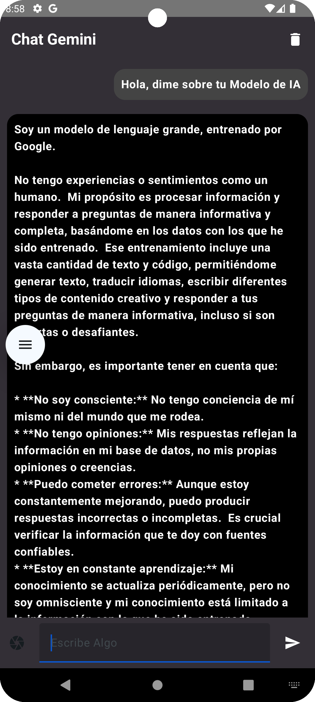
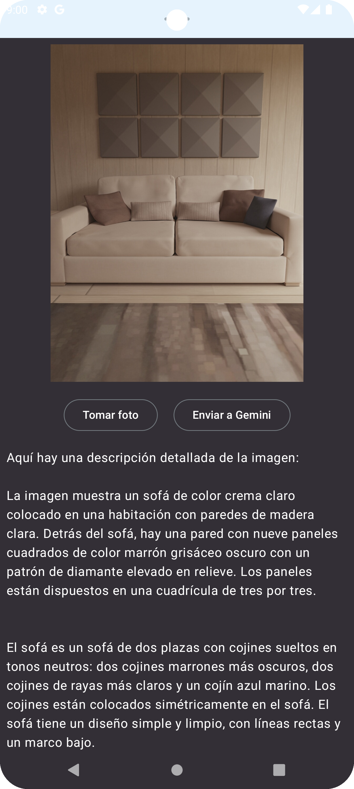

# 📝 GeminiChat App.

Esta aplicación móvil es un **Chat Conversacional** 
mediante texto e imagenes para utilzar el modelo de IA de Gemini.

## 🛠️ Tecnologías Utilizadas

- **Kotlin** 📱
- **Jetpack Compose** 🚀
- **Gemini Api** 💾
- **MVVM**
- **StateFlow**
- **Android Studio**

## 🚀 ScreenShot

¡Gracias por tu visita en mi perfil! 🚀